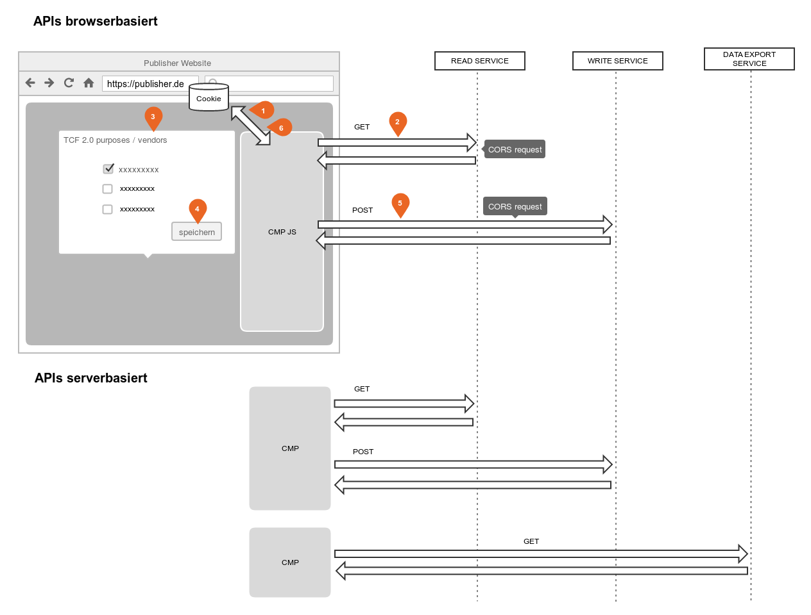

# General information

!!! info ""
    This White Paper was prepared by the European netID Foundation ("EnID") and by 1&1 Mail & Media GmbH ("1&1") - as a recognized technical service provider of "EnID" - to the best of their knowledge, with due diligence and taking into account the current state of knowledge and development.

    "EnID" and "1&1" and their legal representatives and/or vicarious agents do not guarantee that the contents of this white paper are secure, completely usable for certain purposes or otherwise free of errors. The use of this white paper is solely at your own risk.

    In no case "EnID" and "1&1" and their legal representatives and/or vicarious agents are liable for any damage, whether direct or indirect, resulting from the use of the white paper.

## netID Permission Center Services

The following **netID Permission Center Services** are provided which allow a CMP to store / manage netID Permissions, TC Strings for a netID Partner:

- READ SERVICE (read the netID identifier (TPID) or **netID permissions, TC strings**)
- WRITE SERVICE (Writing the **netID Permissions, TC Strings**)
- DATA EXPORT SERVICE (exporting the **netID permissions, TC strings** for the partner)

Currently there is only one netID permission, namely identification. netID does not support the collection and processing of TC strings with global scope.

## Interfaces

The following functionalities are provided to the **CMP:**

- **browser-based** APIs:
    - Reading the netID identifier of a specific user (TPID)
    - Save and retrieve the TC string for the publisher in the netID Permission Center.
- **server-based** APIs:
    - Save and retrieve the TC string for the publisher in the netID Permission Center.
    - Data export (exporting the netID permissions / TC String of the partner)

The distinction browser vs. server-based refers mainly to how active users are identified / from where the APIs are being called.

Call information: Parameters / Header / Cookies

| name | type | function  | description |
| ----------- | ----------- | ----------- | ----------- |
| tapp_id | parameter | authentication | is made available by netID for each publisher when it is onboarded on and must be passed unchanged with each request. |
| origin | header | authentication | is passed by the browser for each XMLHttpsRequest (AJAX). The value must be a URL registered for this partner (TAPP). |
| tpid_sec | cookie | user identification | Only relevant for the browser-based API: is located in the netid.de domain and is automatically passed on by the browser - if available. |
| token | parameter | User recognition/Access Token | Only relevant for the server-based API: Can be retrieved by the partner via the SSO process, is passed to access the API/identify the user |

## Authentication netID Partner

Authentication of partners for the browser-based APIs is handled via the
parameter `tapp_id` and the `Origin` header. Access is secured via
CORS.

- Multiple URLs are allowed per publisher (TAPP). The publisher has to register those URLs upfront
- The read/write request must be made from an eligible URL.

Authentication with the server-based APIs is done as follows.

- The user-specific read/write accesses are secured via access tokens.
- Generic Data Export using Basic Authentication

## User recognition when using APIs

The recognition of the active netID user takes place depending on the
API used by means of the `tpid_sec` (browser-based) or the
`token` (server-based).

`tpid_sec` is an ID Token (JWT) which is stored on the domain
netid.de as part of the SSO session information for the provision of the
netID service during login processes via the SSO/general login with the
netID account provider. This ID token is not accessible for partners /
the CMP.

The Login `token` can be retrieved by a publisher during the SSO
process (OpenID Connect) in the form of a claim. This enables read/write
access independently of the SSO session (limited in time).

If, depending on the context, the `token` or the `tpid_sec` does not
exist, has expired or is invalid, a publisher cannot read/write the TC
String and of course cannot access the TPID.

