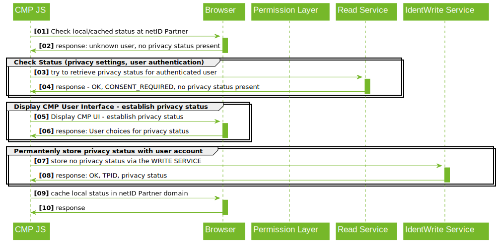

# Browser-based API (web browser integration)

Description of the browser-based integration of the netID Permission
Center by the CMP (integration directly in the user\'s browser
(JavaScript)).



## Exemplary Procedure for obtaining Consents

1. JS checks for the presence of a cookie with the TC string in the Publisher domain.
1. If there is no TC string present → JS tries to retrieve the TC string from the netID READ SERVICE
1. If a TC String exists and permissions suffice → abort and continue processing. Otherwise display overlay for the purpose of obtaining permissions from the user.
1. User makes his choice (TCF /identification with netID) via the CMP Interface
1. JS writes the TC String via the netID WRITE SERVICE, as well as (if given) the consent for identification via netID.
1. JS also writes the TC string as a local cookie in the publisher domain.

## Reading the netID Identifier (TPID)

If the ORIGIN is eligible, a publisher (TAPP) can retrieve the netID
Identifier (TPID) via the following interface:

``` shell
GET https://READSERVICE.netid.de/identification/tpid?tapp_id=<TAPP_ID>
Accept: application/vnd.netid.identification.tpid-read-v1+json
Cookie: tpid_sec=<JWT_TOKEN>
Origin: <ORIGIN>
```

``` shell
200 OK
Content-Type: application/vnd.netid.identification.tpid-read-v1+json
Access-Control-Allow-Origin: <ORIGIN>
Access-Control-Allow-Credentials: true

{
  "tpid": "<TPID>|null"
  "status": "OK|NO_TPID|TOKEN_ERROR|CONSENT_REQUIRED"
}
```

### JSON Properties

| |Description|
|---|---|
| tpid | The ID of the netID user (`tpid`). Only if consent "Identification" is given, the `tpid` is present and status "OK". Otherwise null. |

| status | meaning | pid |
| ----------- | ----------- | ----------- |
| OK | Call successful | x |
| NO_TPID | There was no tpid_sec cookie available. | - |
| TOKEN_ERROR | Token (JWT) in the cookie has expired or is invalid. | - |
| CONSENT_REQUIRED | Consent for passing on the TPID missing ("Identification"). | - |

## Read permission (TC string)

``` shell
GET https://READSERVICE.netid.de/permissions/iab-permissions?tapp_id=<TAPP_ID>
Accept: application/vnd.netid.permissions.iab-permission-read-v1+json
Cookie: tpid_sec=<JWT_TOKEN>
Origin: <ORIGIN>
```

``` shell
200 OK
Content-Type: application/vnd.netid.permissions.iab-permission-read-v1+json
Access-Control-Allow-Origin: <ORIGIN>
Access-Control-Allow-Credentials: true

{
  "tpid": "<TPID>|null",
  "tc": "<TC string>|null",
  "status": "OK|NO_TPID|TOKEN_ERROR|CONSENT_REQUIRED"
}
```

### JSON Properties

| |Description|
|---|---|
| tpid | The ID of the netID user (`tpid`). Only if consent "Identification" is given, the `tpid` is present and status "OK". Otherwise null. |
| tc | The TC string stored for this `tpid` for this publisher (TCF 2.0). Only with status "OK". Otherwise null. |

| status | meaning | tc | pid |
| ----------- | ----------- | ----------- | ----------- |
| OK | Status successfully retrieved | x | x |
| NO_TPID | There was no tpid_sec cookie available. | - | - |
| TOKEN_ERROR | Token (JWT) in the cookie has expired or is invalid. | - | - |
| CONSENT_REQUIRED | Consent for passing on the TPID missing ("Identification"). | x | - |

## Write permission (TC string)

``` shell
POST https://WRITESERVICE.netid.de/permissions/iab-permissions?tapp_id=<TAPP_ID>
Content-Type: application/vnd.netid.permissions.iab-permission-write-v1+json
Cookie: tpid_sec=<JWT_TOKEN>
Origin: <ORIGIN>

{
  "identification": "true|false",
  "tc": "<TC string>"
}
```

``` shell
201 CREATED
Location: https://READSERVICE.netid.de/permissions/iab-permissions?tapp_id=<TAPP_ID>
Access-Control-Allow-Origin: <ORIGIN>
Access-Control-Allow-Credentials: true

{
  "tpid": "<TPID>|null",
  "status": "OK|NO_TPID|TOKEN_ERROR"
}
```

Remarks:

- If permission "identification" has been given by the user, this must be signaled by passing "identification: true". For the avoidance of doubt, this of course requires the prior collection of this consent by the CMP.

- If only the TC string is to be updated and the permission "Identification" already exists, only the "tc" attribute can be passed. Both can also be written at the same time.

- In case of revocation of permission "Identification", would pass only "identification: false".

### JSON Properties

**request**

| |Description|
|---|---|
| identification | The permission "Identification" (ID CONSENT) is to be stored (or revoked). |
| tc | The TC String which should be stored for this tpid` for this publisher (TCF 2.0). |

**response**

| |Description|
|---|---|
| tpid | The ID of the netID user (`tpid`). Only if consent "Identification" is given, the `tpid` is present and status "OK". Otherwise zero.|

| status | meaning |
| ----------- | ----------- |
| OK | TC String / ID CONSENT was saved. |
| NO_TPID | There was no `tpid_sec` cookie available. |
| TOKEN_ERROR | Token (JWT) in the cookie has expired or is invalid. |
