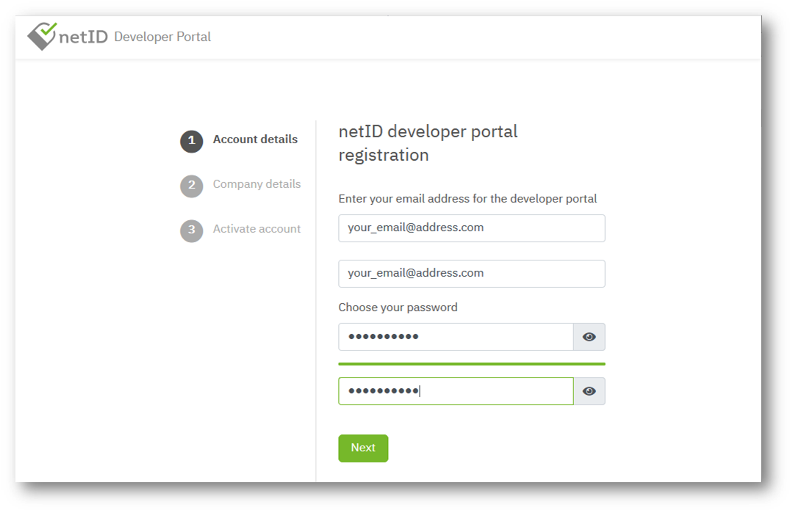

# Get Started

The netID Developer Portal is the main application for developers who want to connect their online services as netID Partner to the Single Sign on service netID.

With netID Developer Portal the developer gets all information for a smooth integration.

In the future, individual reports, information about planned further developments of the netID login standard and much more will be available in the Developer Portal.

In order to use these capabilities, you need to [register yourself](https:\\developer.netid.de)  

The following steps will guide you thru the process.

## Register

## Login

## Problems with Login

