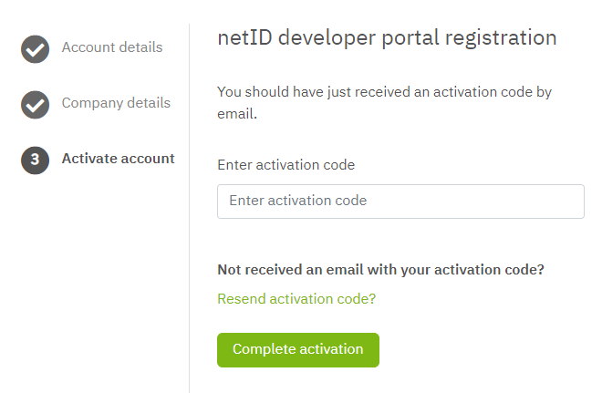

# Getting Started

The netID Developer Portal is the main application for developers who want to connect their online services as netID Partner to the Single Sign on service netID.

With netID Developer Portal the developer gets all information for a smooth integration.

In the future, individual reports, information about planned further developments of the netID login standard and much more will be available in the Developer Portal.

In order to use these capabilities, you need to <a href="https://developer.netid.de" target="_blank">register yourself</a>

The following steps will guide you thru the process.

## Register

- To register for the netID Developer Portal, click on **Create developer account**.

You will be forwarded to the registration page of the netID Developer Portal.

- Enter your email address.
- Enter your password.

!!! info  ""
    A strong password does not need to be changed regularly. However, it should consist of at least 8 characters, better 12 or more. The longer your password, the harder it is to crack. Also mix letters, numbers and special characters and switch between upper and lower case.

-  Confirm your password by repeating the entry and then click on **Next**.

-  Fill out the form with your personal data.
-  Confirm that you have read and accept the user conditions. 
-  Click on **Complete registration**.

An activation code has been sent to the e-mail address provided.

!!! info ""
    If you did not receive an e-mail from us during registration, please contact our support address: support@developer.netid.de

-  Enter the activation code in the input field on the netID Developer Portal web page and click **Complete activation**.

!!! info ""
    You have successfully registered on the netID Developer Portal.

## Login

## Problems with Login

## Contact us

