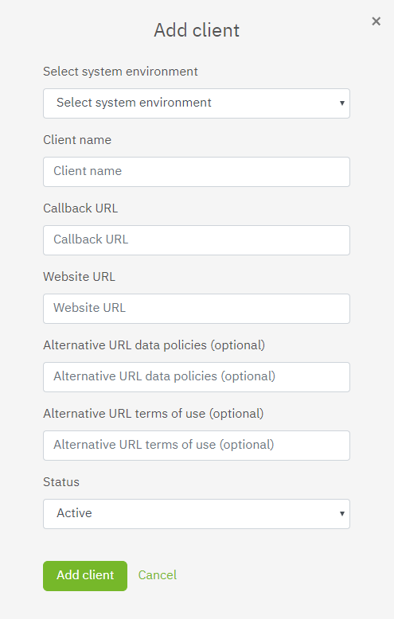

# netID Clients

## Creating a Client 

Create a Client for this service by clicking on Add client.

!!! info ""
    Note: the values here should be adjusted to your needs, especially "Callback URL", which needs to point to your backend

Once the client is created it will initially run in a sandboxed mode, which means it can only be used with whitelisted netID-Accounts (email addresses).

In order to successfully run through the initial integration add a test user (email address) to the whitelist by selecting **Add Test-Account**, 
outlined on the developer portal. Up to 10 accounts can be whitelisted per sandboxed client.

Finally, find the **Client ID** and **netID Token - Sandbox** (later referred to as **client secret**) by expanding the client details. 

## Edit a Client

- Under the appropriate service, select the client to be changed.
- Click **Edit** next to the Client name.

A text box will appear asking you to confirm the operation with your password.

- Enter the password that you created during the registration in the netID Developer Portal and confirm your entry by clicking on **Confirm**.
   
You now have the possibility to change the entered information about the Client.

- Make the desired changes and updates and save the information with a click on **Update Client**.

!!! info ""
    The client was successfully changed.

## Deactivate a Client

- Under the appropriate service, select the client to be disabled.
- Click **Edit** next to the Client name.

A text box will appear asking you to confirm the operation with your password.

- Enter the password you created for logging into the netID Developer Portal and confirm your entry by clicking on **Confirm**.

You now have the possibility to change the status of the Client.

- To deactivate the client, select the entry Inactive in the drop down menu under Status.

!!! info ""
    The client was successfully deactivated.

!!! info ""
    You have the possibility to [reactivate the client](#reactivate-a-client) within 14 days before it is finally deleted and removed from the overview.

## Delete a Client

- Under the appropriate service, select the client to be removed.
- Click the arrow next to the Client name to expand the entire Client.
- Click **Delete Client** below.

A text box will appear asking you to confirm the operation with your password.

- Enter the password that you created during the registration in the netID Developer Portal and confirm your entry by clicking on **Confirm**.

!!! info ""
    The client has been deleted. The status of the deleted client is set to DELETE.

!!! info ""
    You have the possibility to reactivate the client within 14 days before it is finally deleted and removed from the overview.

## Reactivate a Client

A deactivated client remains in the overview. The status of the deleted client is set to DELETE. This gives you the opportunity to reactivate a deactivated client within 14 days before it is finally deleted and removed from the overview.

- Under the appropriate service, select the client to be reactivated.
- Click the arrow next to the Client name to expand the entire Client.
- Click **Reactivate Client** under the Client Status.
- To finally reactivate the client, confirm the process with your developer account password.

!!! info ""
    The client has been reactivated. The status is now displayed again as ACTIVE.