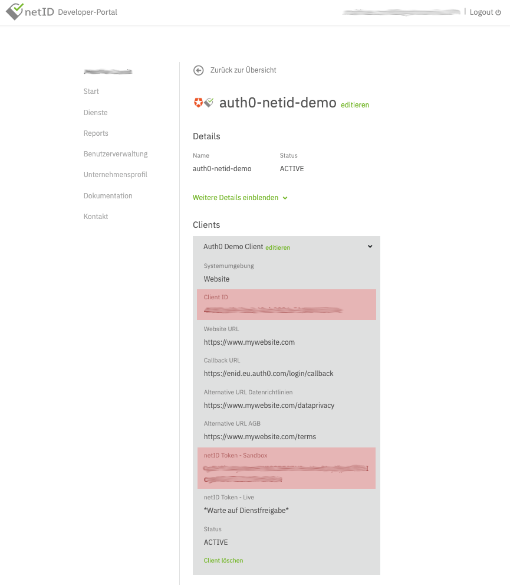

# netID Clients

## Creating a Client 

Create a Client for this service by clicking on Client hinzufügen (Add client). 
Detailed documation on how to do this is available in the netID Developer Portal. 

Sample configuration:

!!! alert ""
    Note: the values here should be adjusted to your needs, especially "Callback URL", which needs to point to your backend

In the end, it should look similar to this:

Once the client is created it will initially run in a sandboxed mode, which means it can only be used with whitelisted netID-Accounts (email addresses).

In order to successfully run through the initial integration add a test user (email address) to the whitelist by selecting **Add Test-Account**, 
outlined on the developer portal. Up to 10 accounts can be whitelisted per sandboxed client.

Finally, find the **Client ID** and **netID Token - Sandbox** (later referred to as **client secret**) by expanding the client details. 

## Edit a Client

## Deactivate a Client

## Delete a Client

## Reactivate a Client
