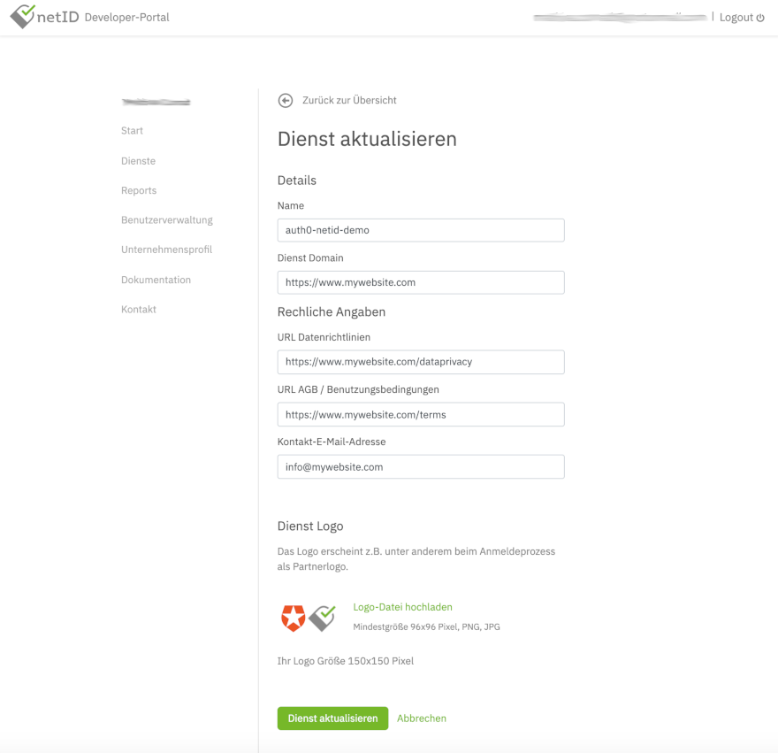
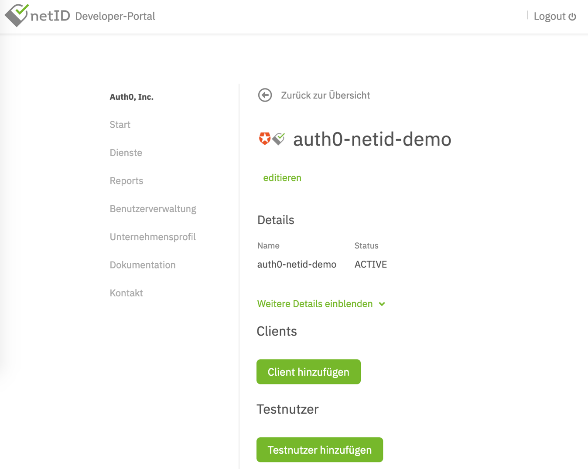

# netID Services

## Prerequisites 
We assume that you have already registered a service provider account at netID. If not, register a netID developer account https://developer.netid.de/ here.

## Creating a Service 

To start, log in into the [netID Developer Portal](https://developer.netid.de/login). Create a **service** for which you want to leverage the netID single sign-on. Select **Services** in the menu, 
click **Add service** and fill in the required details in the following screen. Read the detailed documentation if you need further information.

A sample service could look like this, where the service domain (Dienst Domain) is the domain of your customer facing website. 
Also, links to data privacy information (URL Datenrichtlinien) and terms of usage (URL AGB / Benutzungsbedingungen) should be supplied:

!!! alert ""
    Note: for testing purposes, you can actually enter any domain and URL values into this form, as they are not technically relevant in order to get the netID integration in Auth0 running
 
In the end, it should look similar to this:

## Activate a Service

In order to use a service in your live environment, it must be approved by the netID foundation.

1. Open the detailed view of the service you want to activate.
2. Click on **Release Service**.

!!! info ""
    The service will be released by the netID foundation within the next 24 hours. After successful release you can use the service live.

## Edit a Service

1. To change the details of a service you have already added, click Services in the navigation on the left.
2. Under All Services, select the service whose details you want to update and click Details.
3. Click on edit next to the name of the service.
4. A text box will appear asking you to confirm the operation with your password. 
5. Enter the password you created for registration in the netID Developer Portal and confirm your entry by clicking on Confirm. 

You now have the possibility to edit the entered information about the service. 
Make the desired changes and updates and save the information with a click on Update Service.

!!! success ""
    The service has been changed successfully.

## Delete a Service

1. To remove a service, click on **Services** in the navigation on the left and select the corresponding service from the overview.
2. Click **Show more details**.
3. Click **Delete Service**.
4. To permanently delete the service, confirm the process with your Developer Account password.

!!! success ""
    The service was successfully deleted.

!!! info ""
    You have the possibility to reactivate the service within 14 days before it is permanently deleted and removed from the overview.

## Reactivate a Service

If you delete a service, this service is no longer active. However, you have the possibility to reactivate a deactivated or deleted service within 14 days before it is finally deleted and removed from the system.

1. In the service overview, select the service that you want to reactivate.
2. Click **Details** next to Service names.
3. Click **Show more details**.
4. Click **Reactivate Service**.
5. To finally reactivate the service, confirm the process with your developer account password.

!!! success ""
    The service has been reactivated. The status is now displayed again as ACTIVE.