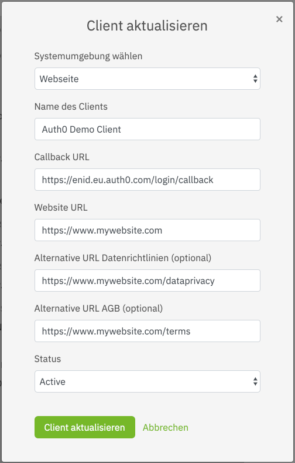
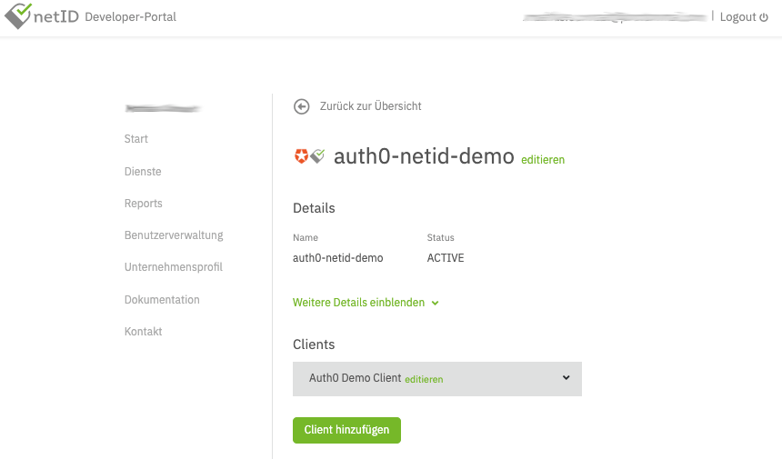
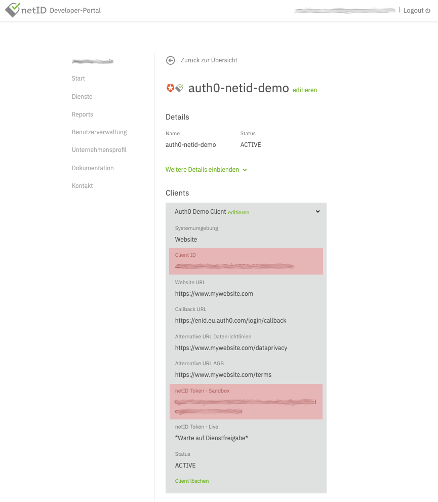

# Creating a netID Service

## Prerequisites 
We assume that you have already registered a service provider account at netID. If not, register a netID developer account https://developer.netid.de/ here.

## Creating a Service 

To start, log in into the [netID Developer Portal](https://developer.netid.de/login). Create a **service** for which you want to leverage the netID single sign-on. Select **Services** in the menu, 
click **Add service** and fill in the required details in the following screen. Read the detailed documentation if you need further information.

A sample service could look like this, where the service domain (Dienst Domain) is the domain of your customer facing website. 
Also, links to data privacy information (URL Datenrichtlinien) and terms of usage (URL AGB / Benutzungsbedingungen) should be supplied:

!!! alert ""
    Note: for testing purposes, you can actually enter any domain and URL values into this form, as they are not technically relevant in order to get the netID integration in Auth0 running
 
In the end, it should look similar to this:

## Activate a Service

## Edit a Service

## Delete a Service

## Reactivate a Service

# Creating a netID Client

## Creating a Client 

Create a Client for this service by clicking on Client hinzufügen (Add client). 
Detailed documation on how to do this is available in the netID Developer Portal. 

Sample configuration:

!!! alert ""
    Note: the values here should be adjusted to your needs, especially "Callback URL", which needs to point to your backend

In the end, it should look similar to this:

Once the client is created it will initially run in a sandboxed mode, which means it can only be used with whitelisted netID-Accounts (email addresses).

In order to successfully run through the initial integration add a test user (email address) to the whitelist by selecting **Add Test-Account**, 
outlined on the developer portal. Up to 10 accounts can be whitelisted per sandboxed client.

Finally, find the **Client ID** and **netID Token - Sandbox** (later referred to as **client secret**) by expanding the client details. 

## Edit a Client

## Deactivate a Client

## Delete a Client

## Reactivate a Client
