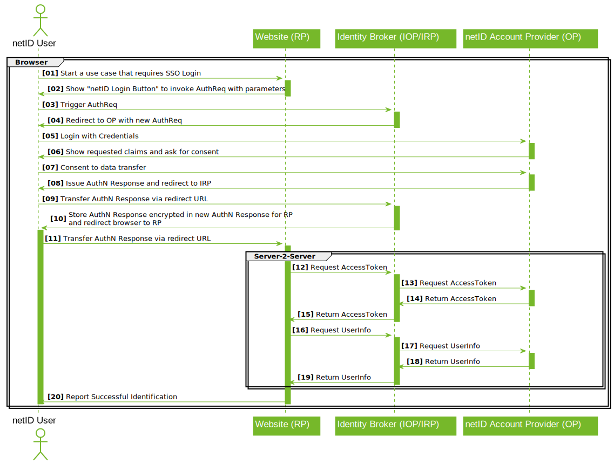

# Single Sign-On Documentation

This documentation describes the netID Single Sign-On to support the integration with interested relying parties. In order to aquire the necessary credentials to leverage this service please refer to the [Developer Portal Documentation](https://asr-enid.github.io/netid-docs/devPortal/services/)

## Integration Guide

### General Overview

The protocol standard applied is OpenID Connect as per the OpenID Connect Core 1.0 specification using the Authorization Code Flow.

Partners manage their data and clients in the netID Developer Portal. There, partners are able to manage their services, which may constitute groups of clients. These services receive the rights granted to partners by end users, which all clients in the group then have access to.

All the clients' communication takes place via EnID's central SSO broker. The SSO broker distributes requests among the participating account providers, end users always authenticate to the account provider responsible for them, which is also where they authorize the release of their data for partners' services.

Where necessary, clients request that data be released netID users; if the user agrees, the client receives an id_token and a userinfo object as a JSON structure.

What the id_token and userinfo objects contain in particular is the end user's subject identifier (sub), which constitutes an ID for both the end user with regard to the service he or she is using as well as the actual client's redirect URI (redirect_uri). This sub value allows the end user to be recognized on the client.

### Claims und Scopes

Every time netID is used to initiate an SSO process, details regarding which information is expected from the end user in the context of the request have to be provided.

For that purpose, the OpenID Connect/OAuth2 scope and claim mechanisms serve as definitions.

Every OpenID Connect request must always request the openid scope. Moreover, the master data required are to be expressed as essential claims.

Once released by the end user, master data need not be provided again unless revoked by the user. The user's approval is saved.

The following claims are supported by netID:

- **gender** - the end user's gender
- **given_name** - the end user's first name (or names)
- **family_name** - the end user's last name
- **birthdate** - the end user's date of birth
- **email** - the end user's email address
- **email_verified** - the verification status of the end user's email address
- **address** - physical mailing address, containing informations on postal code (ZIP), city or town, steet address and country where the end user's address is located

The availability of these claims may, however, vary depending on the end user's account provider; in such cases where not all requested claims are provided, the client must find a way around this.

Claims and scopes that are not requested as essential are ignored.

## Examples

### authorize

authorize requests initiate SSO processes, the clients identify themselves with their client_id and redirect_uri and specify which claims and scopes are to be requested. Some optional parameters are also supported.

Here, the endpoint https://broker.netid.de/authorize is used with the SSO broker.

Examples, given both easy readable as well as in valid URL encoding. The encoding needs to be used for the redirect_uri as well:

**Minimum Query - SSO without requesting any additional data**
    ```bash
    https://broker.netid.de/authorize?
        response_type=code&
        client_id=[clientID]&
        redirect_uri=[redirect_uri]&
        scope=openid
    ```

**Query for “profile” scope as essential claim**
    ```bash
    https://broker.netid.de/authorize?
        response_type=code&
        client_id=[clientID]&
        redirect_uri=[redirect_uri]&
        scope=openid&
        claims={
            "userinfo":{
                "birthdate":{"essential":true},
                "gender":{"essential":true},
                "given_name":{"essential":true},
                "family_name":{"essential":true}
                }
            }
    ```

**Query for claims that correspond to the “profile” scope and “address” as essential**
    ```bash
    https://broker.netid.de/authorize?
        response_type=code&
        client_id=[clientID]&
        redirect_uri=[redirect_uri]&
        scope=openid&
        claims={
            "userinfo":{
                "birthdate":{"essential":true},
                "address":{"essential":true},
                "gender":{"essential":true},
                "given_name":{"essential":true},
                "family_name":{"essential":true}
                }
            }
    ```

### token

Token requests are carried out after the callback to the client in order to exchange the code provided for an access token. It is absolutely necessary that the code used remains unmodified.

Here, the endpoint https://broker.netid.de/token is used with the SSO broker. Client Credentials are required for basic authentication.

Example request per curl:

```
curl -v -u [user:pass] -X POST https://broker.netid.de/token -H 'content-type: application/x-www-form-urlencoded; charset=UTF-8' -d 'code=[code]&redirect_uri=[redirect_uri]&grant_type=authorization_code'
```

### userinfo

The access token is used to retrieve userinfo and id_token.

Here, the endpoint https://broker.netid.de/userinfo is used with the SSO broker.

## Timing and Error Messages

If the authorize request fails, the redirect_uri in the callback is given the reason why this occurred.

With token requests, it's particularly important to ensure that the code provided is identical bit-by-bit to the one received in the callback to the redirect_uri, and to be able to assume that basic authentication is being used properly here. Each code is only valid for 30 seconds!

Access tokens for the userinfo request are valid for 15 minutes and may also be used multiple times within this timeframe.

## Implementation Details

The following request parameters are supported for initiating the SSO process:

* *prompt*
    * login for requiring reauthentication with the account provider
    *  consent for requiring consent to be given again
* *max_age*
    * in cases where time of authentication may not be too far in the past
* *login_hint*
    * to provide and email address in order to prevent the broker's user interface from being visible to the user and thus directly redirect to the relevant account provider
* *state*
    * The value of this parameter is passed through the entire flow transparently and included when calling back to the redirect_uri. It may be used to recognize how authorize request and asynchronous response are associated in the client.

The sequence of the calls is summarized as follows:



Detailed description of diagram:
  
1. The end user initiates a process on the client's site that involves the use of netID.
2. At this point, the client generates a netID button for an authorize request and redirects the end user to the SSO broker.
3. The SSO broker validates the client's authorize request.
4. The SSO broker generates a new authorize request and redirects the user to the OpenID provider. For their part, the broker appears to the OpenID provider as a relying party client.
5. The OpenID provider validates the SSO broker's authorize request and displays the login screen to the end user; the user logs in with the account provider.
6. The OpenID provider shows an approval page to the end user on which all the data he or she is asked to allow transfer of is displayed.
7. The end user agrees to provide the requested data.
8. The OpenID provider generates an AuthN Response and redirects to the SSO broker.
9. The SSO broker receives the AuthN Response from the OpenID provider.
10. The SSO broker generates a new AuthN Response and redirects to the client's redirect_uri.
11. The client receives the SSO broker's AuthN Response.
12. The actual data query is initiated.
13. The client requests the access token with the SSO broker using the Auth Code (from the AuthN Response) and the Client Credentials.
14. The SSO broker requests the access token from the OP using the Auth Code (from the AuthN Response) and the Client Credentials taken from the client.
15. The OpenID provider issues an access token, giving it to the SSO broker.
16. The SSO broker uses the access token to generate a new access token, giving this one to the client.
17. The client uses the access token with the SSO broker to request the userinfo object.
18. The SSO broker uses the access token to request the userinfo object from the OpenID provider.
19. The OpenID provider grants the userinfo object to the SSO broker.
20. The SSO broker grants the userinfo object to the client.
21. The client has now received the userinfo object.

## Styling

The depiction of the netID button is explained in the brand book.

## Best Practices

It is largely up to the relying parties to decide where netID is to be incorporated in clients.

Typical cases involve the use of netID as a login or data enrichment mechanism.

As a login mechanism, for example, netID may be used like other SSO mechanisms (as well as alongside them) as an authentication alternative, or even used as the sole login method. Whether or not a local account is to be held in addition to the netID account is entirely up to the relying party. netID does not provide a classic session, but the SSO process is available via the authorize process at all times. An email address provided to the broker via a browser will be stored as a 1st-party cookie; the end user may decide whether to remain logged in with the account provider. The end user's approval for the transfer of master data will be sought only upon the first request for such data, unless the user revokes his or her approval; ideally, this allows SSO flows to be able to run even with interaction from the user.

If a relying party would like to also be able to handle authentication of end users independently of netID, it is advisable to ensure that mechanisms for merging or separating accounts are provided for. If local account representations with local credentials exist alongside netID, there should also be support processes for handling them; netID support processes only come into effect in connection with netID accounts themselves.

In terms of data enrichment, examples may include using netID during registration processes to make it easier for users to enter information, or as a source for addresses when customers are checking out with their shopping carts online. Whether the data provided is to be used only temporarily or whether it should persist is again left up to the relying parties to freely decide. Each time netID is triggered, the data obtained is up to date in relation to the information currently available to the account provider. With regard to local copies, it may be reasonable to repeatedly request updates and synchronize them. The relying party is to take the principles of data protection into account as they pertain to local data retention.

Ideally, data enrichment processes should be initiated in those places where the data is actually needed. This helps to optimize conversion rates while achieving a high degree of data minimization.

One thing to be aware of is the verification status of email addresses: if an email address has already been verified with netID, a new request from the relying party to verify the email address is, generally speaking, unnecessary and may cause confusion on the part of the end user. Those netID accounts associated with account providers that are, for their part, email providers, are verified from the outset. If such an email account is deleted, not only does the end user lose the ability to use netID, but all support processes based on that email address will come to nothing.

## Security Information

- All communication with netID must be secured by TLS. This also applies to all URLs entered in the developer portal.
- netID exclusively supports the Authorization Code Flow, so that id_token is only transferred in TLS-secured back-end to back-end communication. Currently, the only token signature supported is none.

## Use of SDKs

There are a large number of OpenID Connect client libraries available in many different language environments. Below, several examples will be given, along with tips for using them.

Many client libraries are listed at https://openid.net/developers/libraries/, and others are easy to find.

### General

Regardless of the choice of environment, it's possible to do the following preliminary experiments:

1. In the developer portal for the partner, create a service, request approval for it, and then create a client for it
2. When choosing which URLs to use, it's possible to generate locally applicable test environments by making an entry in the hosts file of a developer workstation at the endpoints given for service and client and creating and using self-signed certificates.
   > **Example** "Entry in hosts" <br>
   127.0.0.1  www.democlient.de <br><br>
   > **Example** "Creating a self-signed certificate" <br>
   openssl req -x509 -nodes -days 365 -newkey rsa:2048 -keyout key.pem -out cert.pem

3. Here, for the Common Name give the host name of the environment you want; so, in this case: www.democlient.de.
Using the Client Credentials from the developer portal, the local host entry, and the certificate with the key, it's possible to run through the netID requests.
4. When testing with browsers, it's a good idea to use private windows; otherwise cookies left behind from previous run-throughs may cause confusion.
to top

### Examples

**PHP**
In PHP it's possible to use the package https://github.com/jumbojett/OpenID-Connect-PHP.However, some adjustments are necessary, since netID always uses none for the token signature algorithm in the Authorization Code Flow.

Installation according to instructions is no problem. The package derives the redirect_uri from its own URL; here, the position of the script in the path of the web server can either be used as redirect_uri when creating the client or configured accordingly in the web server using rewrite rules.

The following minimal diff makes OpenIDConnectClient.php netID-compatible:


```
844a845,848
>         $signature = base64url_decode(array_pop($parts));
>         if (false === $signature || '' === $signature) {
>             throw new OpenIDConnectClientException('Error decoding signature from token');
>         }
874,877d877
< // netID has 'none'
<       case 'none' :
<           $verified=true;
<           break;
```

A simple sample client may then look like this: client_example.php

**Javascript**
One highly recommended JavaScript implementation (node.js) of an OpenID Connect relying party can be found here: https://www.npmjs.com/package/openid-client

**Java**
Spring Security examples for Java:

- GitHub:mitreid-connect/simple-web-app
- GitHub:eugenp/tutorials/tree/master/spring-security-openid

**Rust**
A good OpenID Connect relying party client for Rust can be found here: https://docs.rs/crate/oidc/0.2.0.

**Go**
For go the package GitHub:coreos/go-oidc makes a netID login possible. The package may be installed here:

```
go get github.com/coreos/go-oidc
```

There is no explicit support for entering claims, essential or otherwise.

The simple example client netid.go first needs to be edited before Client Credentials, host name, and certificates may be entered, after which it can be run using:

```
go run netid.go
```
