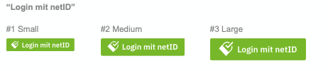
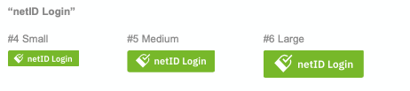
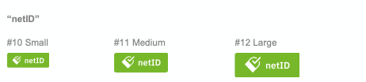

# Styleguide

On the partners' side (technical term Relying Party) netID provides a smooth login experience for the user - besides the usual login or registration. This is realized via the netID button.

The netID button is - like all other SSO services - clearly separated from the usual login / registration mask. Amplified by the brand specific netID green the netID Button should be clearly perceived as an alternative login possibility.

## Integration of the login button

Different buttons are available for integration in the frontend. netID currently offers four "Call to Action" buttons. These are available in three different sizes (small / medium / large). The integration is done via the code snippets provided.

If you have additional requirements for a netID "Call to Action" button for your app or website, please do not hesitate to contact us. Please indicate the size and the button text you would like to use. We will check your requirements against our specifications and provide you with the corresponding code snippet immediately. Please send your special requirements to: info@enid.eu

You want to inform your users - beyond the netID button - with further short information about netID? For this purpose we have created a short description which you can use - please do not change it. Shortened versions of the text are possible.

Alternatives are indicated with brackets `< >`.

!!! info ""
    netID – `<Ihr/Der>` Universal-Login fürs Internet:
    `<Die persönliche>` netID ist der neue europäische Standard für den einfachen, bequemen und sicheren Login bei immer mehr Internetdiensten `</auf immer mehr Webseiten>`. Nur noch ein Passwort merken, persönliche Daten und Zustimmungen selbst zentral im netID Privacy Center organisieren und so jederzeit den Überblick behalten! Mehr Infos auf netid.de

You are also welcome to link to the netID website. On this page users will find all further information about netID. Furthermore, they can register for netID and log in to their individual netID Privacy Center.

https://netid.de

## netID login buttons

### CTA text: "Login mit netID"



```css tab="#1 Small"
<button data-button-size="small"><svg xmlns="http://www.w3.org/2000/svg" width="40" height="40" viewBox="0 0 40 40"><polygon fill="#fff" points="19.14 11.43 21.63 8.99 26.33 13.69 39.59 .5 42.01 2.85 26.25 18.61"></polygon><path fill="#fff" d="M38.22,11.17 L36.22,13.17 C37.35,17 37.09,20 33.1,24 L28.45,28.64 L11.55,11.73 L16.23,7.05 C21.23,2.05 25.33,2.45 30.12,5.4 L32,3.53 C26.07,-0.47 20.47,-0.76 14.4,5.31 L0.67,19 L21.15,39.5 L34.87,25.79 C39.93,20.72 40.32,16.3 38.22,11.17 Z"></path></svg> <span data-button-text="">Login mit netID</span><style>@font-face{font-family:'IBM Plex Sans';font-style:normal;font-weight:600;src:local('IBM Plex Sans SemiBold'),local('IBMPlexSans- SemiBold'),url(https://image.netid.de/ci/netid/global/f onts/ibmplex/IBMPlexSans-SemiBold-webfont.woff) format('woff');unicode-range:U+0000-00FF,U+0131,U+0152- 0153,U+02BB-02BC,U+02C6,U+02DA,U+02DC,U+2000- 206F,U+2074,U+20AC,U+2122,U+2191,U+2193,U+2212,U+2215,U +FEFF,U+FFFD}button{display:flex;flex- wrap:nowrap;justify-content:center;align- items:center;width:100%;max- width:400px;margin:auto;padding:0 1em 0 .875em;border:0 solid transparent;border-radius:3px;background- color:#76b82a;cursor:pointer;font-family:'IBM Plex Sans',Courier;color:#fff;text-decoration:none;text- transform:none;white-space:nowrap;outline:0}@media screen and (min- width:768px){button{width:auto;margin:0}}button svg{width:1.25em;height:1.25em;margin- right:.438em}</style><style size-style="">button[data- button-size=small]{font-size:12px;line- height:24px}</style></button>
```

```css tab="#2 Medium"
<button data-button-size="medium"><svg xmlns="http://www.w3.org/2000/svg" width="40" height="40" viewBox="0 0 40 40"><polygon fill="#fff" points="19.14 11.43 21.63 8.99 26.33 13.69 39.59 .5 42.01 2.85 26.25 18.61"></polygon><path fill="#fff" d="M38.22,11.17 L36.22,13.17 C37.35,17 37.09,20 33.1,24 L28.45,28.64 L11.55,11.73 L16.23,7.05 C21.23,2.05 25.33,2.45 30.12,5.4 L32,3.53 C26.07,-0.47 20.47,-0.76 14.4,5.31 L0.67,19 L21.15,39.5 L34.87,25.79 C39.93,20.72 40.32,16.3 38.22,11.17 Z"></path></svg> <span data-button-text="">Login mit netID</span><style>@font-face{font-family:'IBM Plex Sans';font-style:normal;font-weight:600;src:local('IBM Plex Sans SemiBold'),local('IBMPlexSans- SemiBold'),url(https://image.netid.de/ci/netid/global/f onts/ibmplex/IBMPlexSans-SemiBold-webfont.woff) format('woff');unicode-range:U+0000-00FF,U+0131,U+0152- 0153,U+02BB-02BC,U+02C6,U+02DA,U+02DC,U+2000- 206F,U+2074,U+20AC,U+2122,U+2191,U+2193,U+2212,U+2215,U +FEFF,U+FFFD}button{display:flex;flex- wrap:nowrap;justify-content:center;align- items:center;width:100%;max- width:400px;margin:auto;padding:0 1em 0 .875em;border:0 solid transparent;border-radius:3px;background- color:#76b82a;cursor:pointer;font-family:'IBM Plex Sans',Courier;color:#fff;text-decoration:none;text- transform:none;white-space:nowrap;outline:0}@media screen and (min- width:768px){button{width:auto;margin:0}}button svg{width:1.25em;height:1.25em;margin- right:.438em}</style><style size-style="">button[data- button-size=medium]{font-size:14px;line- height:32px}</style></button>

```

```css tab="#3 Large"
<button data-button-size="large"><svg xmlns="http://www.w3.org/2000/svg" width="40" height="40" viewBox="0 0 40 40"><polygon fill="#fff" points="19.14 11.43 21.63 8.99 26.33 13.69 39.59 .5 42.01 2.85 26.25 18.61"></polygon><path fill="#fff" d="M38.22,11.17 L36.22,13.17 C37.35,17 37.09,20 33.1,24 L28.45,28.64 L11.55,11.73 L16.23,7.05 C21.23,2.05 25.33,2.45 30.12,5.4 L32,3.53 C26.07,-0.47 20.47,-0.76 14.4,5.31 L0.67,19 L21.15,39.5 L34.87,25.79 C39.93,20.72 40.32,16.3 38.22,11.17 Z"></path></svg> <span data-button-text="">Login mit netID</span><style>@font-face{font-family:'IBM Plex Sans';font-style:normal;font-weight:600;src:local('IBM Plex Sans SemiBold'),local('IBMPlexSans- SemiBold'),url(https://image.netid.de/ci/netid/global/ fonts/ibmplex/IBMPlexSans-SemiBold-webfont.woff) format('woff');unicode-range:U+0000-00FF,U+0131,U+0152-0153,U+02BB- 02BC,U+02C6,U+02DA,U+02DC,U+2000- 206F,U+2074,U+20AC,U+2122,U+2191,U+2193,U+2212,U+2215, U+FEFF,U+FFFD}button{display:flex;flex- wrap:nowrap;justify-content:center;align- items:center;width:100%;max- width:400px;margin:auto;padding:0 1em 0 .875em;border:0 solid transparent;border- radius:3px;background- color:#76b82a;cursor:pointer;font-family:'IBM Plex Sans',Courier;color:#fff;text-decoration:none;text- transform:none;white-space:nowrap;outline:0}@media screen and (min- width:768px){button{width:auto;margin:0}}button svg{width:1.25em;height:1.25em;margin- right:.438em}</style><style size-style="">button[data- button-size=large]{font-size:16px;line- height:40px}</style></button>

```

### CTA text: "netID Login"



```css tab="#4 Small"
<button data-button-size="small"><svg xmlns="http://www.w3.org/2000/svg" width="40" height="40" viewBox="0 0 40 40"><polygon fill="#fff" points="19.14 11.43 21.63 8.99 26.33 13.69 39.59 .5 42.01 2.85 26.25 18.61"></polygon><path fill="#fff" d="M38.22,11.17 L36.22,13.17 C37.35,17 37.09,20 33.1,24 L28.45,28.64 L11.55,11.73 L16.23,7.05 C21.23,2.05 25.33,2.45 30.12,5.4 L32,3.53 C26.07,-0.47 20.47,-0.76 14.4,5.31 L0.67,19 L21.15,39.5 L34.87,25.79 C39.93,20.72 40.32,16.3 38.22,11.17 Z"></path></svg> <span data-button-text="">netID Login</span><style>@font-face{font-family:'IBM Plex Sans';font-style:normal;font-weight:600;src:local('IBM Plex Sans SemiBold'),local('IBMPlexSans- SemiBold'),url(https://image.netid.de/ci/netid/global/ fonts/ibmplex/IBMPlexSans-SemiBold-webfont.woff) format('woff');unicode-range:U+0000- 00FF,U+0131,U+0152-0153,U+02BB- 02BC,U+02C6,U+02DA,U+02DC,U+2000- 206F,U+2074,U+20AC,U+2122,U+2191,U+2193,U+2212,U+2215, U+FEFF,U+FFFD}button{display:flex;flex- wrap:nowrap;justify-content:center;align- items:center;width:100%;max- width:400px;margin:auto;padding:0 1em 0 .875em;border:0 solid transparent;border- radius:3px;background-color:#76b82a;cursor:pointer;font-family:'IBM Plex Sans',Courier;color:#fff;text-decoration:none;text- transform:none;white-space:nowrap;outline:0}@media screen and (min- width:768px){button{width:auto;margin:0}}button svg{width:1.25em;height:1.25em;margin- right:.438em}</style><style size-style="">button[data- button-size=small]{font-size:12px;line-height:24px}</style></button>

```

```css tab="#5 Medium"
<button data-button-size="medium"><svg xmlns="http://www.w3.org/2000/svg" width="40" height="40" viewBox="0 0 40 40"><polygon fill="#fff" points="19.14 11.43 21.63 8.99 26.33 13.69 39.59 .5 42.01 2.85 26.25 18.61"></polygon><path fill="#fff" d="M38.22,11.17 L36.22,13.17 C37.35,17 37.09,20 33.1,24 L28.45,28.64 L11.55,11.73 L16.23,7.05 C21.23,2.05 25.33,2.45 30.12,5.4 L32,3.53 C26.07,-0.47 20.47,-0.76 14.4,5.31 L0.67,19 L21.15,39.5 L34.87,25.79 C39.93,20.72 40.32,16.3 38.22,11.17 Z"></path></svg> <span data-button-text="">netID Login</span><style>@font-face{font-family:'IBM Plex Sans';font-style:normal;font-weight:600;src:local('IBM Plex Sans SemiBold'),local('IBMPlexSans- SemiBold'),url(https://image.netid.de/ci/netid/global/ fonts/ibmplex/IBMPlexSans-SemiBold-webfont.woff) format('woff');unicode-range:U+0000- 00FF,U+0131,U+0152-0153,U+02BB- 02BC,U+02C6,U+02DA,U+02DC,U+2000- 206F,U+2074,U+20AC,U+2122,U+2191,U+2193,U+2212,U+2215, U+FEFF,U+FFFD}button{display:flex;flex- wrap:nowrap;justify-content:center;align- items:center;width:100%;max- width:400px;margin:auto;padding:0 1em 0 .875em;border:0 solid transparent;border- radius:3px;background-color:#76b82a;cursor:pointer;font-family:'IBM Plex Sans',Courier;color:#fff;text-decoration:none;text- transform:none;white-space:nowrap;outline:0}@media screen and (min- width:768px){button{width:auto;margin:0}}button svg{width:1.25em;height:1.25em;margin- right:.438em}</style><style size-style="">button[data- button-size=medium]{font-size:14px;line-height:32px}</style></button>

```

```css tab="#6 Large"
<button data-button-size="large"><svg xmlns="http://www.w3.org/2000/svg" width="40" height="40" viewBox="0 0 40 40"><polygon fill="#fff" points="19.14 11.43 21.63 8.99 26.33 13.69 39.59 .5 42.01 2.85 26.25 18.61"></polygon><path fill="#fff" d="M38.22,11.17 L36.22,13.17 C37.35,17 37.09,20 33.1,24 L28.45,28.64 L11.55,11.73 L16.23,7.05 C21.23,2.05 25.33,2.45 30.12,5.4 L32,3.53 C26.07,-0.47 20.47,-0.76 14.4,5.31 L0.67,19 L21.15,39.5 L34.87,25.79 C39.93,20.72 40.32,16.3 38.22,11.17 Z"></path></svg> <span data-button-text="">netID Login</span><style>@font-face{font-family:'IBM Plex Sans';font-style:normal;font-weight:600;src:local('IBM Plex Sans SemiBold'),local('IBMPlexSans- SemiBold'),url(https://image.netid.de/ci/netid/global/ fonts/ibmplex/IBMPlexSans-SemiBold-webfont.woff) format('woff');unicode-range:U+0000- 00FF,U+0131,U+0152-0153,U+02BB- 02BC,U+02C6,U+02DA,U+02DC,U+2000- 206F,U+2074,U+20AC,U+2122,U+2191,U+2193,U+2212,U+2215, U+FEFF,U+FFFD}button{display:flex;flex- wrap:nowrap;justify-content:center;align- items:center;width:100%;max- width:400px;margin:auto;padding:0 1em 0 .875em;border:0 solid transparent;border- radius:3px;background-color:#76b82a;cursor:pointer;font-family:'IBM Plex Sans',Courier;color:#fff;text-decoration:none;text- transform:none;white-space:nowrap;outline:0}@media screen and (min- width:768px){button{width:auto;margin:0}}button svg{width:1.25em;height:1.25em;margin- right:.438em}</style><style size-style="">button[data- button-size=large]{font-size:16px;line-height:40px}</style></button>

```

### CTA text: "Mit netID anmelden"


```css tab="#7 Small"
<button data-button-size="small"><svg xmlns="http://www.w3.org/2000/svg" width="40" height="40" viewBox="0 0 40 40"><polygon fill="#fff" points="19.14 11.43 21.63 8.99 26.33 13.69 39.59 .5 42.01 2.85 26.25 18.61"></polygon><path fill="#fff" d="M38.22,11.17 L36.22,13.17 C37.35,17 37.09,20 33.1,24 L28.45,28.64 L11.55,11.73 L16.23,7.05 C21.23,2.05 25.33,2.45 30.12,5.4 L32,3.53 C26.07,-0.47 20.47,-0.76 14.4,5.31 L0.67,19 L21.15,39.5 L34.87,25.79 C39.93,20.72 40.32,16.3 38.22,11.17 Z"></path></svg> <span data-button-text="">Mit netID anmelden</span><style>@font-face{font-family:'IBM Plex Sans';font-style:normal;font-weight:600;src:local('IBM Plex Sans SemiBold'),local('IBMPlexSans- SemiBold'),url(https://image.netid.de/ci/netid/global/ fonts/ibmplex/IBMPlexSans-SemiBold-webfont.woff) format('woff');unicode-range:U+0000- 00FF,U+0131,U+0152-0153,U+02BB- 02BC,U+02C6,U+02DA,U+02DC,U+2000- 206F,U+2074,U+20AC,U+2122,U+2191,U+2193,U+2212,U+2215, U+FEFF,U+FFFD}button{display:flex;flex- wrap:nowrap;justify-content:center;align- items:center;width:100%;max- width:400px;margin:auto;padding:0 1em 0 .875em;border:0 solid transparent;border- radius:3px;background-color:#76b82a;cursor:pointer;font-family:'IBM Plex Sans',Courier;color:#fff;text-decoration:none;text- transform:none;white-space:nowrap;outline:0}@media screen and (min- width:768px){button{width:auto;margin:0}}button svg{width:1.25em;height:1.25em;margin- right:.438em}</style><style size-style="">button[data- button-size=small]{font-size:12px;line-height:24px}</style></button>

```

```css tab="#8 Medium"
<button data-button-size="medium"><svg xmlns="http://www.w3.org/2000/svg" width="40" height="40" viewBox="0 0 40 40"><polygon fill="#fff" points="19.14 11.43 21.63 8.99 26.33 13.69 39.59 .5 42.01 2.85 26.25 18.61"></polygon><path fill="#fff" d="M38.22,11.17 L36.22,13.17 C37.35,17 37.09,20 33.1,24 L28.45,28.64 L11.55,11.73 L16.23,7.05 C21.23,2.05 25.33,2.45 30.12,5.4 L32,3.53 C26.07,- 0.47 20.47,-0.76 14.4,5.31 L0.67,19 L21.15,39.5 L34.87,25.79 C39.93,20.72 40.32,16.3 38.22,11.17 Z"></path></svg> <span data-button-text="">Mit netID anmelden</span><style>@font-face{font-family:'IBM Plex Sans';font-style:normal;font- weight:600;src:local('IBM Plex Sans SemiBold'),local('IBMPlexSans- SemiBold'),url(https://image.netid.de/ci/netid/globa l/fonts/ibmplex/IBMPlexSans-SemiBold-webfont.woff) format('woff');unicode-range:U+0000- 00FF,U+0131,U+0152-0153,U+02BB- 02BC,U+02C6,U+02DA,U+02DC,U+2000- 206F,U+2074,U+20AC,U+2122,U+2191,U+2193,U+2212,U+221 5,U+FEFF,U+FFFD}button{display:flex;flex-wrap:nowrap;justify-content:center;align- items:center;width:100%;max- width:400px;margin:auto;padding:0 1em 0 .875em;border:0 solid transparent;border- radius:3px;background- color:#76b82a;cursor:pointer;font-family:'IBM Plex Sans',Courier;color:#fff;text-decoration:none;text- transform:none;white-space:nowrap;outline:0}@media screen and (min- width:768px){button{width:auto;margin:0}}button svg{width:1.25em;height:1.25em;margin- right:.438em}</style><style size- style="">button[data-button-size=medium]{font- size:14px;line-height:32px}</style></button>

```

```css tab="#9 Large"
<button data-button-size="large"><svg xmlns="http://www.w3.org/2000/svg" width="40" height="40" viewBox="0 0 40 40"><polygon fill="#fff" points="19.14 11.43 21.63 8.99 26.33 13.69 39.59 .5 42.01 2.85 26.25 18.61"></polygon><path fill="#fff" d="M38.22,11.17 L36.22,13.17 C37.35,17 37.09,20 33.1,24 L28.45,28.64 L11.55,11.73 L16.23,7.05 C21.23,2.05 25.33,2.45 30.12,5.4 L32,3.53 C26.07,- 0.47 20.47,-0.76 14.4,5.31 L0.67,19 L21.15,39.5 L34.87,25.79 C39.93,20.72 40.32,16.3 38.22,11.17 Z"></path></svg> <span data-button-text="">Mit netID anmelden</span><style>@font-face{font-family:'IBM Plex Sans';font-style:normal;font- weight:600;src:local('IBM Plex Sans SemiBold'),local('IBMPlexSans- SemiBold'),url(https://image.netid.de/ci/netid/global /fonts/ibmplex/IBMPlexSans-SemiBold-webfont.woff) format('woff');unicode-range:U+0000- 00FF,U+0131,U+0152-0153,U+02BB- 02BC,U+02C6,U+02DA,U+02DC,U+2000- 206F,U+2074,U+20AC,U+2122,U+2191,U+2193,U+2212,U+2215 ,U+FEFF,U+FFFD}button{display:flex;flex-wrap:nowrap;justify-content:center;align- items:center;width:100%;max- width:400px;margin:auto;padding:0 1em 0 .875em;border:0 solid transparent;border- radius:3px;background- color:#76b82a;cursor:pointer;font-family:'IBM Plex Sans',Courier;color:#fff;text-decoration:none;text- transform:none;white-space:nowrap;outline:0}@media screen and (min- width:768px){button{width:auto;margin:0}}button svg{width:1.25em;height:1.25em;margin- right:.438em}</style><style size- style="">button[data-button-size=large]{font- size:16px;line-height:40px}</style></button>

```

### CTA text: "netID"



```css tab="#10 Small"
<button data-button-size="small"><svg xmlns="http://www.w3.org/2000/svg" width="40" height="40" viewBox="0 0 40 40"><polygon fill="#fff" points="19.14 11.43 21.63 8.99 26.33 13.69 39.59 .5 42.01 2.85 26.25 18.61"></polygon> <path fill="#fff" d="M38.22,11.17 L36.22,13.17 C37.35,17 37.09,20 33.1,24 L28.45,28.64 L11.55,11.73 L16.23,7.05 C21.23,2.05 25.33,2.45 30.12,5.4 L32,3.53 C26.07,-0.47 20.47,-0.76 14.4,5.31 L0.67,19 L21.15,39.5 L34.87,25.79 C39.93,20.72 40.32,16.3 38.22,11.17 Z"></path></svg> <span data-button-text="">netID</span> <style>@font-face{font-family:'IBM Plex Sans';font- style:normal;font-weight:600;src:local('IBM Plex Sans SemiBold'),local('IBMPlexSans- SemiBold'),url(https://image.netid.de/ci/netid/global/fo nts/ibmplex/IBMPlexSans-SemiBold-webfont.woff) format('woff');unicode-range:U+0000-00FF,U+0131,U+0152- 0153,U+02BB-02BC,U+02C6,U+02DA,U+02DC,U+2000- 206F,U+2074,U+20AC,U+2122,U+2191,U+2193,U+2212,U+2215,U+ FEFF,U+FFFD}button{display:flex;flex- wrap:nowrap;justify-content:center;align- items:center;width:100%;max- width:400px;margin:auto;padding:0 1em 0 .875em;border:0 solid transparent;border-radius:3px;background- color:#76b82a;cursor:pointer;font-family:'IBM Plex Sans',Courier;color:#fff;text-decoration:none;text- transform:none;white-space:nowrap;outline:0}@media screen and (min- width:768px){button{width:auto;margin:0}}button svg{width:1.25em;height:1.25em;margin- right:.438em}</style><style size-style="">button[data-button-size=small]{font-size:12px;line-height:24px}</style> </button>
```

```css tab="#12 Medium"
<button data-button-size="medium"><svg xmlns="http://www.w3.org/2000/svg" width="40" height="40" viewBox="0 0 40 40"><polygon fill="#fff" points="19.14 11.43 21.63 8.99 26.33 13.69 39.59 .5 42.01 2.85 26.25 18.61"></polygon><path fill="#fff" d="M38.22,11.17 L36.22,13.17 C37.35,17 37.09,20 33.1,24 L28.45,28.64 L11.55,11.73 L16.23,7.05 C21.23,2.05 25.33,2.45 30.12,5.4 L32,3.53 C26.07,-0.47 20.47,-0.76 14.4,5.31 L0.67,19 L21.15,39.5 L34.87,25.79 C39.93,20.72 40.32,16.3 38.22,11.17 Z"></path></svg> <span data-button- text="">netID</span><style>@font-face{font-family:'IBM Plex Sans';font-style:normal;font- weight:600;src:local('IBM Plex Sans SemiBold'),local('IBMPlexSans- SemiBold'),url(https://image.netid.de/ci/netid/global/ fonts/ibmplex/IBMPlexSans-SemiBold-webfont.woff) format('woff');unicode-range:U+0000- 00FF,U+0131,U+0152-0153,U+02BB- 02BC,U+02C6,U+02DA,U+02DC,U+2000- 206F,U+2074,U+20AC,U+2122,U+2191,U+2193,U+2212,U+2215, U+FEFF,U+FFFD}button{display:flex;flex-wrap:nowrap;justify-content:center;align- items:center;width:100%;max- width:400px;margin:auto;padding:0 1em 0 .875em;border:0 solid transparent;border- radius:3px;background- color:#76b82a;cursor:pointer;font-family:'IBM Plex Sans',Courier;color:#fff;text-decoration:none;text- transform:none;white-space:nowrap;outline:0}@media screen and (min- width:768px){button{width:auto;margin:0}}button svg{width:1.25em;height:1.25em;margin- right:.438em}</style><style size-style="">button[data-button-size=medium]{font-size:14px;line- height:32px}</style></button>

```

```css tab="#12 Large"
<button data-button-size="large"><svg xmlns="http://www.w3.org/2000/svg" width="40" height="40" viewBox="0 0 40 40"><polygon fill="#fff" points="19.14 11.43 21.63 8.99 26.33 13.69 39.59 .5 42.01 2.85 26.25 18.61"></polygon><path fill="#fff" d="M38.22,11.17 L36.22,13.17 C37.35,17 37.09,20 33.1,24 L28.45,28.64 L11.55,11.73 L16.23,7.05 C21.23,2.05 25.33,2.45 30.12,5.4 L32,3.53 C26.07,-0.47 20.47,-0.76 14.4,5.31 L0.67,19 L21.15,39.5 L34.87,25.79 C39.93,20.72 40.32,16.3 38.22,11.17 Z"></path></svg> <span data-button- text="">netID</span><style>@font-face{font-family:'IBM Plex Sans';font-style:normal;font- weight:600;src:local('IBM Plex Sans SemiBold'),local('IBMPlexSans- SemiBold'),url(https://image.netid.de/ci/netid/global/ fonts/ibmplex/IBMPlexSans-SemiBold-webfont.woff) format('woff');unicode-range:U+0000- 00FF,U+0131,U+0152-0153,U+02BB- 02BC,U+02C6,U+02DA,U+02DC,U+2000- 206F,U+2074,U+20AC,U+2122,U+2191,U+2193,U+2212,U+2215, U+FEFF,U+FFFD}button{display:flex;flex-wrap:nowrap;justify-content:center;align- items:center;width:100%;max- width:400px;margin:auto;padding:0 1em 0 .875em;border:0 solid transparent;border- radius:3px;background- color:#76b82a;cursor:pointer;font-family:'IBM Plex Sans',Courier;color:#fff;text-decoration:none;text- transform:none;white-space:nowrap;outline:0}@media screen and (min- width:768px){button{width:auto;margin:0}}button svg{width:1.25em;height:1.25em;margin- right:.438em}</style><style size-style="">button[data- button-size=large]{font-size:16px;line- height:40px}</style></button>

```
